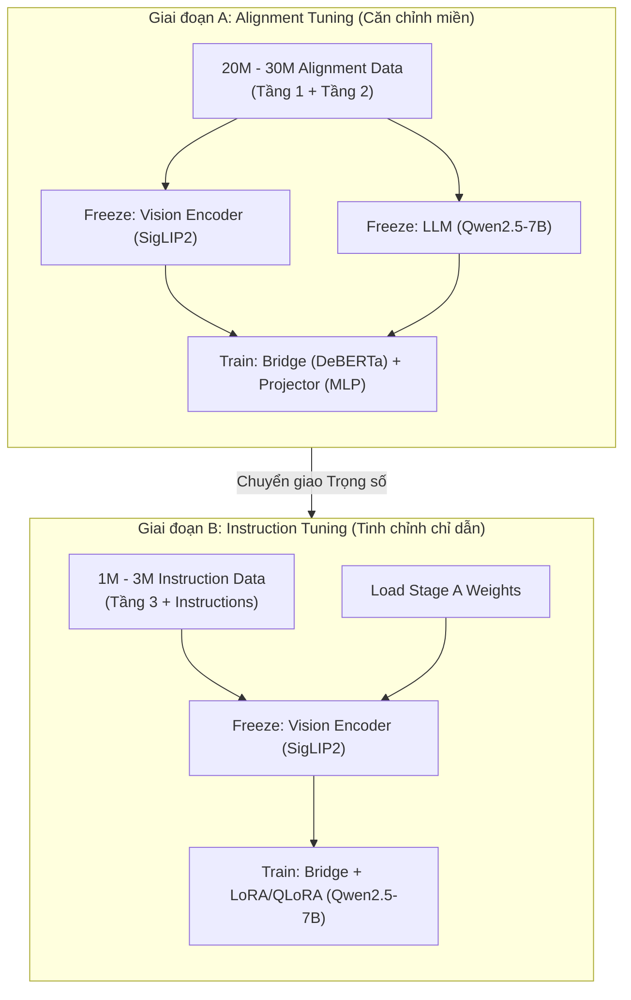

# CHIẾN LƯỢC XÂY DỰNG VÀ TỔ CHỨC DỮ LIỆU HUẤN LUYỆN CHO SDQ-VLM
*Phân tích lựa chọn kiến trúc, phân tầng dữ liệu theo Scaling Law và định hướng bản địa hóa tiếng Việt*

---

## 1. Quyết định Kiến trúc Chiến lược: InstructBLIP Clone vs. Next-Gen VLM

Quyết định kiến trúc cho **SDQ-VLM** đứng trước hai hướng đi mang tính quyết định đến sự thành bại và tiềm năng phát triển lâu dài của mô hình:

### Hướng 1: InstructBLIP Clone (Truyền thống)
* **Lộ trình:** Đi theo cấu trúc cổ điển của InstructBLIP, sử dụng Q-Former để ánh xạ đặc trưng ảnh sang LLM dựa trên tập dữ liệu VQA cơ bản.
* **Hạn chế:** Quy trình tổ chức dữ liệu tuyến tính và đơn điệu: **Caption $\rightarrow$ VQA $\rightarrow$ Hoàn thành**. Hướng đi này không còn tương thích với các khám phá mới về **Scaling Law**, dễ dẫn đến hiện tượng bão hòa hiệu năng và không tận dụng được tối đa sức mạnh của các bộ mã hóa thị giác thế hệ mới.

### Hướng 2: Next-Gen VLM (SigLIP2 + Qwen2.5) [KHUYÊN DÙNG]
* **Lộ trình:** Xây dựng mô hình Vision-Language thế hệ mới kết hợp giữa **SigLIP2** (cho đặc trưng thị giác vượt trội) và **Qwen2.5-7B** (cho khả năng lập luận ngôn ngữ SOTA) thông qua cơ chế phân tầng dữ liệu.
* **Góc nhìn từ Scaling Law:** Các VLM mạnh nhất thế giới hiện nay đều phát triển theo chu kỳ huấn luyện 3 giai đoạn chặt chẽ chứ không đi theo lối mòn cũ:
  1. **Stage 1 (Massive Vision-Language Alignment):** Căn chỉnh diện rộng không gian thị giác - ngôn ngữ.
  2. **Stage 2 (Instruction Tuning):** Tinh chỉnh mô hình theo chỉ dẫn đa nhiệm.
  3. **Stage 3 (Reasoning Enhancement):** Tăng cường khả năng lập luận logic đa bước.

> [!IMPORTANT]
> **Định hướng hành động:** SDQ-VLM sẽ được xây dựng theo **Hướng 2 (Next-Gen VLM)**. Do đó, cấu trúc dữ liệu huấn luyện sẽ không tổ chức theo kiểu InstructBLIP truyền thống nữa mà được thiết kế lại toàn diện thành **4 Tầng Dữ liệu** để đáp ứng tối ưu Scaling Law.

---

## 2. Thiết kế Kiến trúc Dữ liệu 3 Tầng (3-Tier Data Architecture)

Để tối ưu hóa không gian ngữ nghĩa thị giác và năng lực lập luận, tập dữ liệu huấn luyện của SDQ-VLM được chia làm 4 tầng độc lập từ thấp đến cao:

```
Tầng 3: Reasoning (Lập luận logic, quan hệ không gian, Why/How)
  ▲
Tầng 2: Dense Understanding (Mô tả chi tiết vùng ảnh, thuộc tính vật thể)
  ▲
Tầng 1: Foundation Alignment (Ảnh → Khái niệm ngữ nghĩa cơ bản)
```

### Tầng 1 — Foundation Alignment (Căn chỉnh nền tảng)
* **Mục tiêu:** Ánh xạ từ **Ảnh $\rightarrow$ Khái niệm (Concept)**. Giúp Bridge (DeBERTa-v3 Q-Former) và Projector (MLP) học được cách chuyển đổi không gian thị giác biểu diễn bởi SigLIP2 sang không gian ngữ nghĩa (Visual Semantic Space) tương thích với LLM.
* **Ví dụ:** Khi nhận đầu vào là ảnh một con chó, mô hình phải tự căn chỉnh không gian biểu diễn tương ứng với các khái niệm: `dog`, `animal`, `pet`, `golden retriever`, `running`, `grass`, `outdoor`...
* **Nguồn dữ liệu:**
  * **DataComp-12M hoặc DataComp-50M** (Khuyên dùng thay thế cho LAION vì DataComp đã được lọc kỹ, loại bỏ hầu hết dữ liệu rác/nhiễu).
  * **CC12M** (Conceptual Captions 12M).

### Tầng 2 — Dense Understanding (Hiểu chi tiết và quan hệ không gian)
* **Mục tiêu:** Khắc phục điểm yếu lớn nhất của các VLM mã nguồn mở hiện nay là chỉ nhìn tổng quát (Global-level) mà thiếu năng lực nhìn chi tiết (Region-level).
* **Ví dụ:** Đối với ảnh một căn bếp, thay vì chỉ tạo caption đơn giản là *"A kitchen (Một phòng bếp)"*, mô hình phải nhận diện và mô tả được chi tiết: *"microwave on shelf (lò vi sóng trên kệ)"*, *"white refrigerator (tủ lạnh màu trắng)"*, *"pizza inside oven (bánh pizza trong lò)"*, *"red cup on table (cốc màu đỏ trên bàn)"*.
* **Nguồn dữ liệu:**
  * **Visual Genome** (~5M region descriptions - mô tả chi tiết từng vùng ảnh).
  * **ShareGPT4V** (1.2M mô tả chất lượng cao do GPT-4V sinh ra).
  * **LLaVA-665K** (Bộ dữ liệu huấn luyện đa dạng các tác vụ thị giác).

### Tầng 3 — Reasoning (Lập luận phức tạp)
* **Mục tiêu:** Phát triển năng lực tư duy logic đa bước của mô hình. Vượt qua các câu hỏi mô tả đơn thuần (*"What is this?"*) để giải quyết các câu hỏi mang tính suy luận phức tạp.
* **Ví dụ:** Trả lời các câu hỏi dạng: *"Why?" (Tại sao?)*, *"How many?" (Có bao nhiêu?)*, *"What happens next?" (Điều gì xảy ra tiếp theo?)*, *"Which object is closer?" (Vật thể nào nằm gần hơn?)*.
* **Nguồn dữ liệu:**
  * **GQA** (22M cặp câu hỏi-đáp cấu trúc dựa trên đồ thị cảnh vật).
  * **A-OKVQA** & **OK-VQA** (VQA yêu cầu tri thức nền tảng bên ngoài - External Knowledge).
  * **ScienceQA** (Câu hỏi khoa học đa phương thức).
  * **CLEVR** & **NLVR2** (Lập luận hình học và so sánh logic).

---

## 3. Lộ trình Huấn luyện Phân kỳ (Two-Stage Training Strategy)

Để tránh hiện tượng suy hao trọng số (catastrophic forgetting) và tối ưu hóa tài nguyên GPU, quá trình tinh chỉnh chỉ dẫn (Instruction Tuning) cho SDQ-VLM không thực hiện từ đầu (scratch) mà chia làm 2 giai đoạn kế thừa:



### Giai đoạn A: Alignment Tuning (Căn chỉnh miền)
* **Quy mô dữ liệu:** **20M – 30M** mẫu Alignment (chủ yếu thuộc Tầng 1 và Tầng 2).
* **Cơ chế cập nhật:**
  * Đóng băng (Frozen ❄️): Vision Encoder (SigLIP2) và LLM (Qwen2.5-7B).
  * Huấn luyện (Trainable 🔥): Bridge (DeBERTa Q-Former) và Projector (MLP).
* **Mục tiêu:** Giúp Bridge học cách dịch chuyển và nén các đặc trưng thị giác từ SigLIP2 sang không gian biểu diễn ngữ nghĩa của LLM một cách mượt mà nhất.

### Giai đoạn B: Instruction Tuning (Tinh chỉnh chỉ dẫn)
* **Quy mô dữ liệu:** **1M – 3M** mẫu Instruction (thuộc Tầng 3 và tập dữ liệu chỉ dẫn chung).
* **Cơ chế cập nhật:**
  * Đóng băng (Frozen ❄️): Vision Encoder (SigLIP2).
  * Huấn luyện (Trainable 🔥): Bridge (DeBERTa Q-Former), Projector (MLP), và các tham số **LoRA/QLoRA** tích hợp trong LLM (Qwen2.5-7B).
* **Mục tiêu:** Rèn luyện khả năng tuân thủ chỉ dẫn đa tác vụ, kết nối thông tin thị giác và lập luận ngôn ngữ để sinh câu trả lời chính xác.

---

## 4. Ước tính Quy mô Tập dữ liệu (Estimated Data Scale)

Để đạt ngưỡng **Research-grade VLM** (mô hình VLM cấp độ nghiên cứu thực tế vượt trội ngoài demo học thuật), tập dữ liệu cần đạt quy mô từ **6B đến 12B tokens**, tương đương khoảng **33 triệu mẫu (33M samples)** phân bổ chi tiết như sau:

| Tập dữ liệu | Phân tầng dữ liệu | Số lượng mẫu (Samples) | Tỷ lệ (%) | Vai trò chiến lược trong huấn luyện |
| :--- | :--- | :--- | :--- | :--- |
| **DataComp** | Tầng 1 — Foundation Alignment | 10,000,000 | 30.3% | Cung cấp khái niệm thị giác cơ bản, sạch, ít rác |
| **CC12M** | Tầng 1 — Foundation Alignment | 12,000,000 | 36.4% | Mở rộng vốn từ vựng và khái niệm ảnh-chữ đa dạng |
| **Visual Genome** | Tầng 2 — Dense Understanding | 5,000,000 | 15.2% | Học chi tiết vị trí, mối quan hệ và thuộc tính vật thể |
| **ShareGPT4V** | Tầng 2 — Dense Understanding | 1,000,000 | 3.0% | Nâng cao chất lượng mô tả vùng ảnh qua GPT-4V |
| **OCR Data** | Tầng 3 — OCR | 2,000,000 | 6.1% | Tăng cường đọc chữ, xử lý tài liệu và biểu đồ hình ảnh |
| **Reasoning Data** | Tầng 4 — Reasoning | 2,000,000 | 6.1% | Huấn luyện tư duy logic, đếm số và suy luận nhân quả |
| **Instruction Data**| Giai đoạn B — Instruction Tuning | 1,000,000 | 3.0% | Định hình khả năng hội thoại và phản hồi theo chỉ dẫn |
| **TỔNG CỘNG** | | **~33,000,000** | **100%** | **Research-grade VLM (~6B - 12B tokens)** |

---

## 5. Chiến lược Bản địa hóa: Pipeline Dữ liệu Tiếng Việt Chất lượng cao

Hầu hết các VLM mã nguồn mở mạnh mẽ hiện nay rất mạnh ở tiếng Anh nhưng khả năng xử lý thị giác-ngôn ngữ tiếng Việt còn khá yếu, đặc biệt là nhận diện chữ viết bản địa và am hiểu văn hóa.

> [!TIP]
> **Điểm khác biệt chiến lược (Differentiator):** Dành riêng **10% – 20%** dung lượng dữ liệu huấn luyện chất lượng cao cho tiếng Việt. Điều này giúp SDQ-VLM tạo ra sự khác biệt rõ rệt và cạnh tranh trực tiếp với các mô hình quốc tế trên thị trường bản địa.

### Các trục dữ liệu tiếng Việt trọng tâm:

1. **Sách giáo khoa Việt Nam (Toán, Lý, Hóa, Sinh, Địa lý):**
   * *Nội dung:* Chứa sơ đồ thực nghiệm, biểu đồ thống kê, bài toán hình học kèm câu hỏi suy luận tiếng Việt.
   * *Mục tiêu:* Nâng cao năng lực **Tầng 4 (Reasoning)** và giải quyết các bài toán học thuật bản địa.

2. **Biển báo, hạ tầng giao thông và bản đồ đường phố Việt Nam:**
   * *Nội dung:* Ảnh chụp giao thông thực tế tại Việt Nam, biển báo giao thông đặc thù, vạch kẻ đường và các biển hiệu viết tay.
   * *Mục tiêu:* Tăng cường khả năng nhận diện cảnh quan thực tế đô thị Việt Nam.

3. **Hóa đơn, hóa đơn bán lẻ, biên lai & tài liệu hành chính Việt Nam:**
   * *Nội dung:* Ảnh chụp/scan hóa đơn đỏ, hóa đơn viết tay, các biểu mẫu hành chính, văn bản pháp luật có cấu trúc bảng biểu tiếng Việt phức tạp.
   * *Mục tiêu:* Tối ưu hóa năng lực **Tầng 3 (OCR)** phục vụ trực tiếp cho các bài toán số hóa tài liệu doanh nghiệp Việt Nam.

4. **Ảnh đời sống, văn hóa, ẩm thực và danh lam thắng cảnh Việt Nam:**
   * *Nội dung:* Hình ảnh về các nét văn hóa đặc trưng (xe máy chở hàng, nón lá, món ăn Việt Nam như phở, bánh mì, chợ nổi...).
   * *Mục tiêu:* Xây dựng sự hiểu biết sâu sắc về ngữ cảnh văn hóa và thực thể địa phương, tránh các lỗi diễn giải sai lệch từ các mô hình quốc tế.
